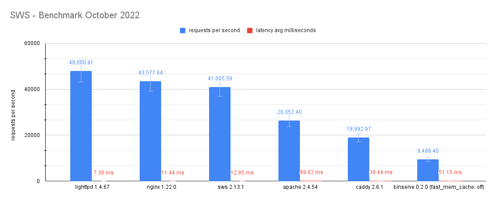

# SWS - Benchmarks 2022-10

## Web servers used

- **lighttpd** `1.4.67` (default config)
- **nginx** `1.22.0` (default config + worker_processes=4, access_log=off)
- **sws** `2.13.1` (default config)
- **apache** `2.4.54` (default config)
- **caddy** `2.6.1` (default config)
- **binserve** `0.2.0` (default config + **fast_mem_cache=false**, enable_hot_reload=false, enable_logging=false, enable_directory_listing=false)

## Data used

All data generated is available under this directory in JSON, CSV or text formats.

## System used

- **OS:** Arch Linux
- **Kernel:** 5.19.13-arch1-1 (64 bits)
- **Processor:** 4 × Intel® Core™ i7-6500U
- **RAM:** 8 GiB
