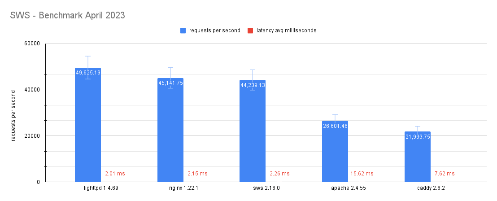

# SWS - Benchmarks 2023-04

## Web servers used

- **lighttpd** `1.4.69` (default config)
- **nginx** `1.22.1` (default config + worker_processes=4, access_log=off)
- **sws** `2.16.0` (default config)
- **apache** `2.4.55` (default config)
- **caddy** `2.6.2` (default config)

## Data used

All data generated is available under this directory in JSON, CSV or text formats.

## System used

- **OS:** Arch Linux
- **Kernel:** 6.1.11-arch1-1 (64 bits)
- **Processor:** 4 × Intel® Core™ i7-6500U
- **RAM:** 8 GiB
